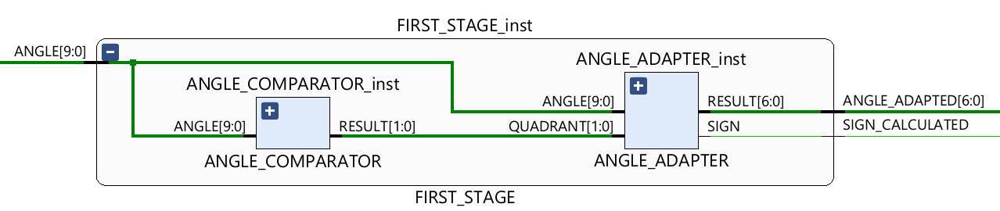
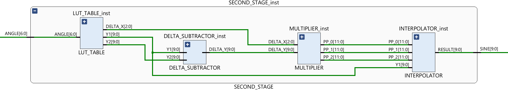
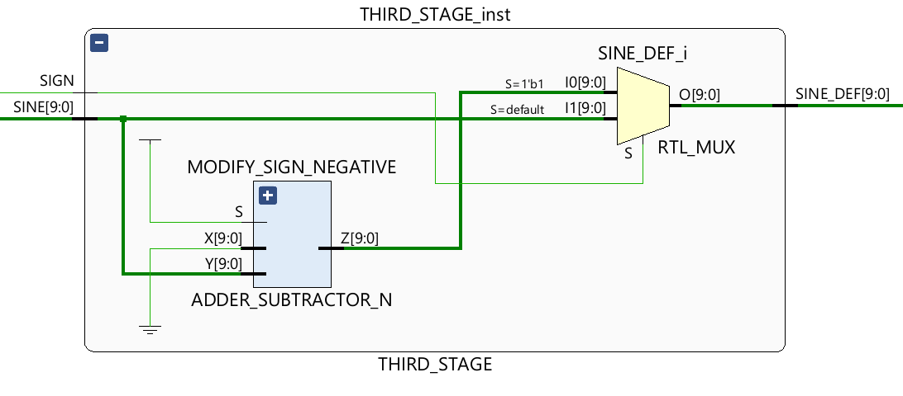
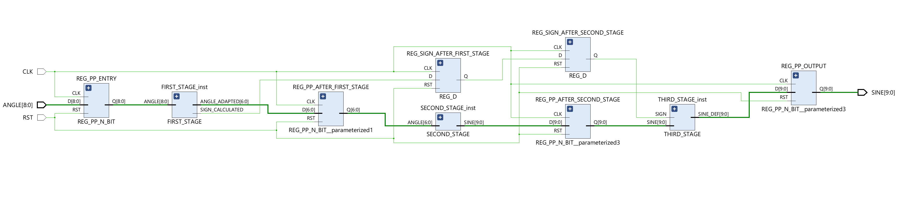

# Sine Calculator Fixed Point

VHDL implementation of a fixed-point sine calculator, developed as a digital logic design project.

The module receives an integer angle between 0 and 359 degrees and returns `sin(angle)` on 10 bits in signed fixed-point format. The architecture uses a 4-cycle pipeline, a lookup table for values between 0 and 90 degrees, and linear interpolation for angles not explicitly present in the LUT.

## Specifications

- `ANGLE` input on 9 bits, encoded as natural binary, in the range `0..359`
- `SINE` output on 10 signed fixed-point bits
- Output format: 2 bits for the integer part and 8 bits for the fractional part
- Result range: `[-1, 1]`
- Overall latency: 4 clock cycles

Top-level interface:

```vhdl
entity SINE_FUNCTION_FIXED_POINT is
    PORT(
        ANGLE   : in std_logic_vector(8 downto 0);
        SINE    : out std_logic_vector(9 downto 0);
        CLK     : in std_logic;
        RST     : in std_logic
    );
end SINE_FUNCTION_FIXED_POINT;
```

## Design approach

The computation uses trigonometric identities to map any input angle into the first quadrant:

- `0..90`: direct use
- `91..180`: `180 - angle`
- `181..270`: `angle - 180`
- `271..359`: `360 - angle`

The sign of the sine is determined from the quadrant and applied only in the final pipeline stages.

For angles between 0 and 90 degrees, the sine value is obtained from a lookup table containing:

- samples from `0` to `88` degrees with step `8`
- the values for `89` and `90` degrees

If the angle does not match a LUT sample, the system uses linear interpolation in the corresponding interval. Using an 8-degree step simplifies the computation because the final interpolation division can be implemented as a 3-bit right shift.

## Architecture

The system is organized into three main stages.

### First Stage

Maps the angle into the `0..90` range and determines the final sign of the result.

Main components:

- `ANGLE_COMPARATOR`
- `ANGLE_ADAPTER`
- `FIRST_STAGE`



### Second Stage

Computes the absolute value of the sine using the lookup table and linear interpolation.

Main components:

- `LUT_TABLE`
- `DELTA_SUBTRACTOR`
- `MULTIPLIER`
- `INTERPOLATOR`
- `SECOND_STAGE`



### Third Stage

Applies the sign to the absolute value produced by the second stage.

Main components:

- `ADDER_SUBTRACTOR_N`
- `THIRD_STAGE`



### Top-level view



## Pipeline timing

- Cycle 1: angle acquisition and mapping to the first quadrant
- Cycle 2: LUT read and linear interpolation
- Cycle 3: sign application
- Cycle 4: output register stage

Before applying new stimuli, `RST` should be asserted to clear the pipeline registers.

## Repository structure

```text
images/
progetto.srcs/
  sim_1/new/
    TB_FIRST_STAGE.vhd
    TB_SECOND_STAGE.vhd
    TB_SINE_CALCULATOR_FIXED_POINT.vhd
    TB_THIRD_STAGE.vhd
  sources_1/new/
    ADDER_SUBTRACTOR_N.vhd
    ANGLE_ADAPTER.vhd
    ANGLE_COMPARATOR.vhd
    DELTA_SUBTRACTOR.vhd
    FA.vhd
    FIRST_STAGE.vhd
    INTERPOLATOR.vhd
    LUT_TABLE.vhd
    MULTIPLIER.vhd
    RCA_N.vhd
    REG_D.vhd
    REG_PP_N_BIT.vhd
    SECOND_STAGE.vhd
    SINE_FUNCTION_FIXED_POINT.vhd
    THIRD_STAGE.vhd
Relazione reti logiche.docx
```

## Main modules

- `FA`: 1-bit full adder
- `RCA_N`: parameterized ripple-carry adder
- `ADDER_SUBTRACTOR_N`: parameterized adder/subtractor
- `REG_D`: 1-bit D flip-flop
- `REG_PP_N_BIT`: parameterized parallel register
- `ANGLE_COMPARATOR`: quadrant detection
- `ANGLE_ADAPTER`: angle mapping into `0..90` and sign generation
- `LUT_TABLE`: sine samples and `DELTA_X`
- `DELTA_SUBTRACTOR`: computes `Y2 - Y1`
- `MULTIPLIER`: generates partial products
- `INTERPOLATOR`: implements linear interpolation

## Verification

The repository includes dedicated testbenches for the three stages and for the complete system:

- `TB_FIRST_STAGE.vhd`
- `TB_SECOND_STAGE.vhd`
- `TB_THIRD_STAGE.vhd`
- `TB_SINE_CALCULATOR_FIXED_POINT.vhd`

In the top-level testbench, the clock is set to `20 ns` and the pipeline length is fixed at `4` cycles. The checked cases include representative values and corner cases such as:

- `0° -> 0`
- `45° -> 180` in fixed-point representation
- `90° -> 256`
- `181° -> -4`
- `225° -> -180`
- `359° -> -4`

The checks are implemented with `assert` statements.

## How to use the project

### In Vivado

1. Open or recreate a VHDL project.
2. Import the files in `progetto.srcs/sources_1/new/`.
3. Import the testbenches from `progetto.srcs/sim_1/new/`.
4. Set `SINE_FUNCTION_FIXED_POINT` as the top module for synthesis, or `TB_SINE_CALCULATOR_FIXED_POINT` as the top module for simulation.
5. Run behavioural or post-place-and-route simulation depending on your workflow.

### Module usage sequence

1. Assert `RST` to clear the registers.
2. Apply a valid value on `ANGLE`.
3. Wait 4 clock edges.
4. Read `SINE` on the output.

## Documentation source

This README was reconstructed from:

- the project report `Relazione reti logiche.docx`
- the VHDL files in the repository
- the diagrams in the `images/` folder